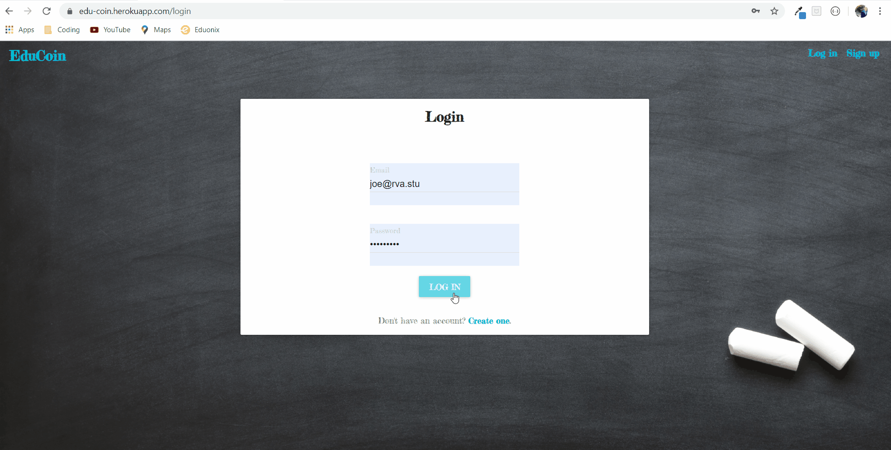

# EduCoin
This repository ("EduCoin") is an application that gives students a chance to earn their share of a digital currency while participating in their daily school lives. After earning currency the students can use it to purchase rewards or save it for future financial opportunities. 

## Installation

The application is deployed using github and heroku. The main pages can be opened in the browser. As a first time user they will signup as either a student or teacher. Afterwards, the teacher view will show the entire database, while the student's page will only display their individual record. 

## User Story
**As a** financially curious student\
**I want** to earn digital currency\
**So that** I can learn strong financial practices early in life.  

## Built With
[Node.js](https://nodejs.org/en/docs/) -Backend development language\
[Material-UI](https://v0.material-ui.com/#/components/app-bar) -Page design template\
[Passport.js](http://www.passportjs.org/docs/) -Middleware authentication\
[React.js](https://reactjs.org/docs/getting-started.html) -JavaScript library for building user interfaces\
[JavaScript](https://developer.mozilla.org/en-US/docs/Web/JavaScript) -Frontend development language and server usage

## Credits

Joe Bailey, Nathan Olenik, and Rob Quinn created this by focusing on different parts of the overall application. Joe focused on the data entry, presentation, reward routes, and tweaking the backend. Nathan developed the majority of the table design, components, data schematics, and researched troubleshooting techniques for the backend of the application. Rob did a lot of the routing, database manipulation, design, and overall deployment. 

